# Talend ETL

Java를 기반으로 한 ETL Tool

200여개의 데이터 처리 컴포넌트를 이용해 GUI화면에서 데이터 처리 흐름을 작성하는 Tool이다.

## 대표적으로 사용되는 컴포넌트

데이터베이스 입출력, 파일 입출력에 관한 기본적인 컴포넌트는 설명을 생략합니다.

#### 1. tAggregateRow

  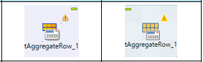
	
데이터를 집계하는 컴포넌트

합계, 평균, 최대값, 최소값 등 입력받은 데이터를 이용해 데이터집계를 실행한다.

기준이 되는 데이터, 집계되는 데이터, 각 데이터별 집계방법을 설정한다.

#### 2. tChangeFileEncoding

  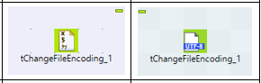
	
파일의 인코딩을 변경하는 컴포넌트

파일과 인코딩방법을 설정하여 인코딩방법을 변경한 파일을 출력시킨다.

#### 3. tConvertType

  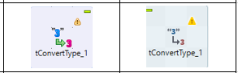
	
데이터의 형태를 변경하는 컴포넌트

입력받은 데이터의 각 항목의 형태(숫자데이터, 문자데이터 등)를 변경시켜 출력시킨다.

그 외 사용법) 모든 항목(셀)에 숫자,문자 등 자유로운 입력이 가능한 Excel파일과 같은 경우, 각 항목에 지정된 형태에 맞는 데이터가 입력되었는지 핸들링을 할 때에 사용할 수 있다.

데이터 입력시 숫자 데이터를 문자형태로 입력(tFileInput에서 숫자로 지정한 항목에 문자데이터가 입력될경우 에러가 발생하기 때문에, Input에서는 전부 문자데이터로 입력을 받는다)받은 후, tConvertType에서 숫자형태로 변경시킨다. 이때 숫자항목에 문자데이터가 입력 될 경우 에러헨들링을 이용할 수 있다.

#### 4. tCreateTable

  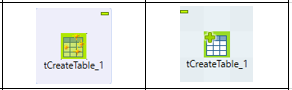
	
데이터베이스에 테이블을 생성하는 컴포넌트

데이터를 만들기 전 우선적으로 테이블을 생성할 필요가 있는 경우 사용한다.

#### 5. tDenormalize

  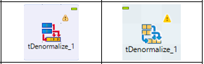
	
입력받은 데이터를 지정한 기호를 이용해 하나의 데이터로 만드는 컴포넌트

복수row의 데이터를 입력받아 하나의 row로 합쳐준다. 이 때에 각 데이터를 끊어줄 기호를 지정(,;TAB등)한다. 또한 옵션에서 같은 데이터를 merge하도록 지정할 수 있다.

#### 6. tNormalize

  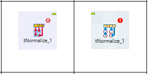
	
입력받은 데이터를 지정한 기호를 이용해 잘라내는 컴포넌트

하나의 컬럼에 대해서 지정한 기호로 데이터를 잘라준다. 이 때 잘라진 데이터는 순서대로 데이터의 갯수만큼 row가 나누어저 생성돤다. (한개의 컬럼에 데이터의 수가 늘어남)
옵션을 통해 
1. 마지막에 빈칸이 있는경우 버리기 
2. 자른 데이터 중 중복된 데이터 버리기 
3. CSV파라메이터 사용 
4. 결과를 트리밍(여분의 스페이스 제거) 

를 지정할 수 있다.

#### 7. tExtractDelimitedFields

  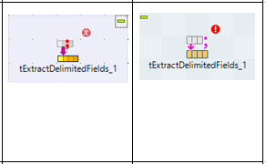
	
입력받은 데이터를 지정한 기호를 이용해 잘라내는 컴포넌트

하나의 컬럼에 대해서 지정한 기호로 데이터를 잘라준다. 이 때 잘라진 데이터는 순서대로 데이터의 갯수만큼 컬럼이 생성돤다. (컬럼의 갯수가 늘어남)
미리 생성될 컬럼의 갯수만큼 컬럼을 설정할 필요가 있다.

옵션을 통해 
1. Null 데이터 무시하기
2. 결과를 트리밍(여분의 스페이스 제거) 
3. 단위자르기 기호 지정(1000단위로 ,입력, 소수점기호 등)

를 지정할 수 있다.

#### 8. tFileCopy

  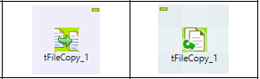
	
파일을 복사하는 컴포넌트

폴더채로 복사가 가능하다.
복사한 파일의 파일명을 변경할 수 있다.
복사 후 기존 파일을 삭제할 수 있다.
이미 같은 이름의 파일이 존재하는 경우 파일을 덮어쓸 수 있다.

#### 9. tFileDelete

  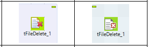
	
파일을 삭제하는 컴포넌트

지정한 파일 또는 폴더를 삭제한다.

#### 10. tFileExist

  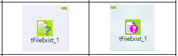
	
파일이 존재하는지 확인하는 컴포넌트

확인하고자 하는 파일은 1개만 지정이 가능하다.
[tFileList],[tFileInput]와 연결해 지정한 디렉토리안에 있는 복수의 파일을 읽어들일때에, 읽어들이기 전에 디렉토리안의 파일을 하나씩 확인하며 읽어들이도록 설정할 수 있다.

#### 11. tFileList

  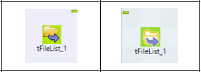
	
지정한 폴더안을 검색하여 리스트를 보여주는 컴포넌트

검색하고자 하는 디렉토리를 설정하여 그 안에 있는 서브폴더, 파일 등을 검색한다.
[tFileProperties],[tFileInput]와 연결해 파일의 종류(확정자를 확인해 판단)별로 List안의 모든 파일을 읽어들이도록 설정할 수 있다.

#### 12. tFileProperties

  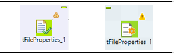
	
지정한 파일의 정보를 보여주는 컴포넌트

지정한 파일의 프로파티를 확인하여 디렉토리명, 파일명, 사이즈, 갱신일 등의 정보를 데이터로 사용할 수 있게 해준다.

#### 13. tFilterColumns

  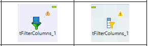
	
입력받은 데이터에서 사용하고 싶은 항목을 줄여주는 컴포넌트

입력받은 항목(컬럼) 중애서 사용하고자 하는 항목만 out에 설정해 출력시킨다.

#### 14. tFilterRow

  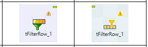
	
조건을 지정해 데이터를 선별해주는 컴포넌트

SQL의 WHERE구와 비슷한 효과가 있다.
[Reject]를 이용하여 조건에 일치하지 않은 데이터를 사용할 수 도 있다.

#### 15. tFixedFlowInput

  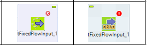
	
고정데이터를 생성해주는 컴포넌트

동적인 데이터가 아닌 고정된 데이터를 생성하고자 할 경우 사용한다.

예를들어, 
- 로그 출력시 정해진 메세지를 생성하고자 할 때 
- 데이터를 1개 추가하고자 할 때 
- 테스트용 데이터를 1건 생성하고자 할 때
