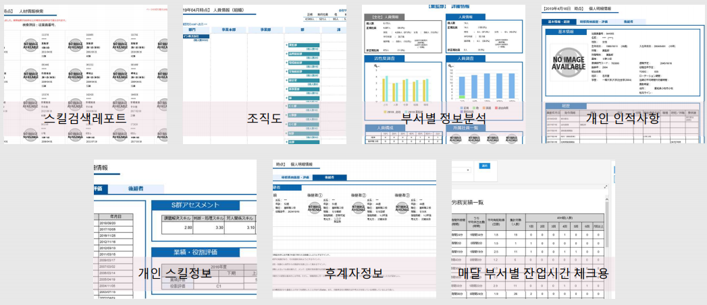
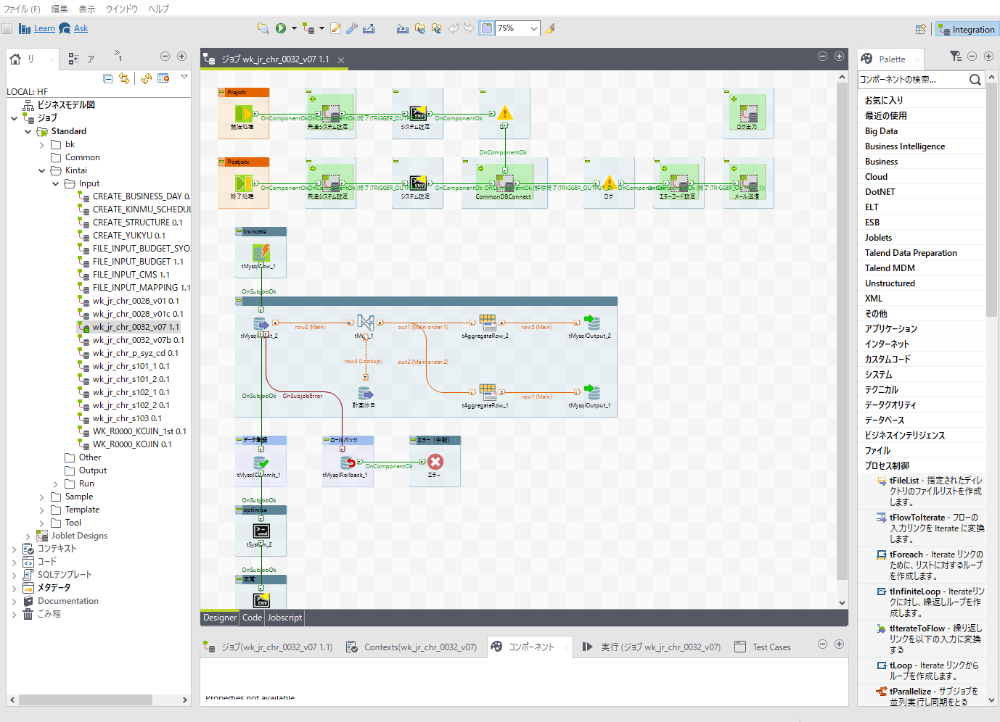

## Project 01
### 데이터 분석 지원 프로젝트 (고객:NGK)
#### 고객소개
- 회사명 : NGK INSULATORS, LTD.
- 본사 : 일본 나고야시
- 사업내용 : 절연제, 세라믹 제품 생산 등
- 창립 : 1919년 5월 5일
- 직원수 : 3,272

#### 프로젝트 개요
인사데이터 베이스의 구축 및 가시화 레포트 개발

인사시스템의 DB(Oracle)와 타 시스템에서 출력된 csv파일, 부서별 운용되는 Excel파일 등 으로부터 데이터를 수집하여 인사데이터베이스를 구축(사용DB : MySQL)

구축된 데이터베이스를 이용해 각종 데이터분석 레포트를 개발

#### 개발내용
1. 조직도에서 한눈에 조직별 사원수를 확인할 수 있을것.(부서별 사원분포(겸무사원 포함)분석)
2. 선택한 부서의 년도X고용형태별 사원수, 
  회사전체와 선택부서의 평가결과점수비교, 
  나이대X직위별 사원수,
  회사전체와 선택부서의 기본적인 성별비율, 평균연령, 정사원비율 등 정보 등 다양한 관점에서의 인사데이터 분석
3. 개인의 연도별 평가점수, 보유자격증 및 연수참가이력, 기본정보, 경력, 후계자정보 등 사원의 정보를 가시화
4. 자격증, 직위, 나이, 성별, 입사년수 등을 검색어로 인재정보검색 창 개발
5. 부서별 잔업시간을 분석, 평균잡업시간, 휴일출근시간, 45시간(일본법의 기준시간)을 넘은 횟수 등을 분석
  잔업시간과 연차사용횟수의 best20, worst20 을 분석

#### 개발한 레포트 이미지

#### 개발한 ETL 이미지
개발한 job은 bat파일로 출력 후 Windows Task Schedule에 등록하여 자동실행된다.

* Excel파일, CSV파일의 DB등록
* Oracle에서 MySQL로 데이터이동
* 데이터 클리닝
* 레포팅에 필요한 데이터 구성에 맞춘 데이터 가공

등의 job를 개발하였습니다.

약 20개의 job 중 1개의 화면이미지.

#### 어려웠던점
인사데이터의 데이터양이 많아서 개발한 레포트의 실행속도를 높이는데에 큰 어려움이 있었다.

SQL과 DB의 튜닝 , 파라메터의 사용방법 변경 등 다양한 방법을 모색하여 무사히 기간안에 프로젝트를 완료할 수 있었다.

