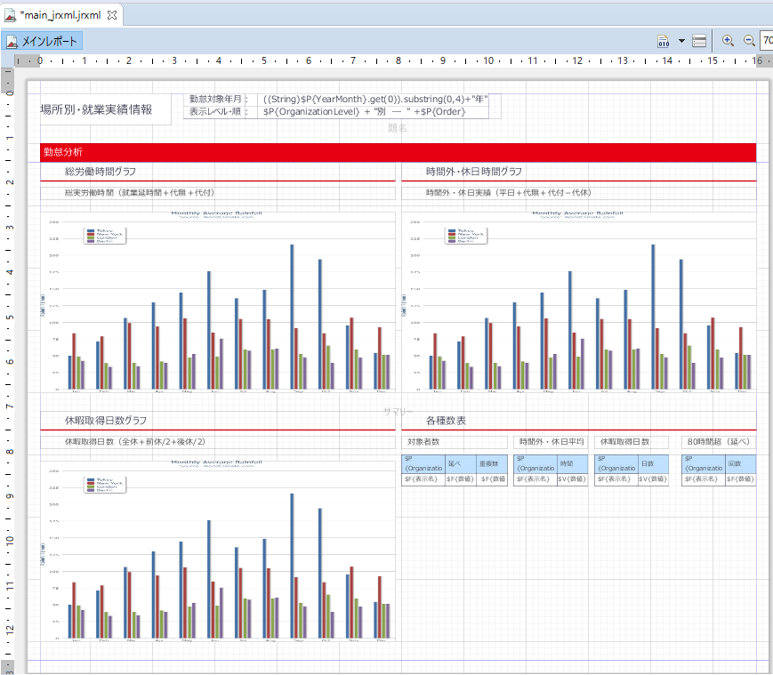

## Project 02
### 온사이트 기술지원 프로젝트 (고객:MELTEC)
#### 고객소개
- 회사명 : MITSUBISHI ELECTRIC BUILDING TECHNOSERVICE CO., LTD.
- 본사 : 일본 도쿄도
- 사업내용 : 건물 관리 시스템, 엘리베이터, 에스컬레이터 생산
- 창립 : 1954년 3월 29일
- 직원수 : 9,989

#### 프로젝트 개요
근로시간 통계분석을 위한 데이터베이스 구축과 가시화 레포트 개발

처음 프로그렘 도입시 제작된 클라이언트 전용 샘플을 이용해 실제로 운용할 수 있는 ETL과 레포트를 제작.
우선 첫 6개월동안 본사의 데이터로 프로젝트를 진행, 프로젝트가 성공할 경우 그룹회사의 프로젝트를 시작할 예정.

* 프로젝트기간 : 클라이언트 내 프로젝트기간 6개월 중 기술지원 3개월
* 프로젝트멤버 : 1명(본인)

#### 프로젝트 내용
1. 클라이언트 내 ETL 개발 담당자 1명이 스스로 ETL개발이 가능할 수 있도록 기술지원 및 컨설팅을 진행
2. 클라이언트 내 레포트 개발 담당자 1명이 스스로 레포트개발이 가능할 수 있도록 기술지원 및 컨설팅을 진행
3. ETL개발 목표
   * Oracle에 있는 인사데이터와 타 시스템으로부터 CSV출력되어 연계되는 근로시간 데이터를 
    수집, 가공하여 MySQL에 새로운 데이터베이스를 구축하기.
   * 방대한 양의 데이터를 매일 전송해야하기 때문에 속도 튜닝(SQL튜닝, 데이터 플로 튜닝)하기.
4. 레포트 개발 목표
   * 일본의 근로시간에 관한 법률에서 꼭 필요한 레포트를 전부 개발할 것(잔업시간, 이터벌시간 등)
	* 한눈에 보기 쉽고 유저빌리티가 좋은 레포트를 개발할 것
5. 잔업시간 초과 알람 메일 송신 기능을 추가로 개발
6. 주1회 클라이언트 방문하여 개발에 관한 Q&A를 진행, 어려움이 있는 부분은 현장에서 해결

#### 개발 화면 이미지

#### 경험한 내용
당일에 질문을 받고 그자리에서 해답&해결 해야하기 때문에 미리 준비가 불가능했다.

그 자리에서 SQL을 튜닝하고, ETL 플로의 오류를 해결하고, 추가 요구에 맞는 레포트 개발 방법을 전수하는 등 약 3개월간 프로젝트를 진행하면서
순발력과 판단력을 많이 기를 수 있었다.

어떤 문제가 있을때 어떤 해결을 해야하는지, 어떤식으로 고객에게 설명을 해야 알기 쉬운지 파악할 수 있는 좋은 경험이었다.

또한 혼자 진행했던 프로젝트 이었기 때문에, 스케쥴관리 품질관리, 보고, 고객과의 관계 등 PM업무도 조금 경험할 수 있었다.

※프로젝트의 6개월동안 담당 고객분들은 무사히 프로젝트를 성공시키셨고, 2019년 중순에 그룹 전체의 프로젝트를 시작하게 되었다는 연락을 받았다.

------------------------------
