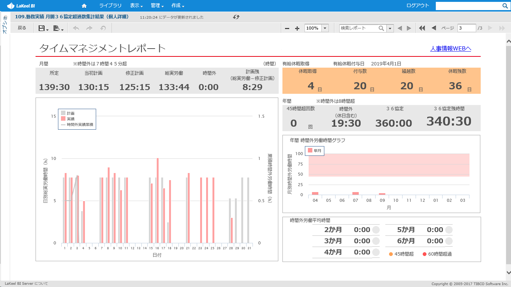

## Project 03
### 데이터 분석 지원 프로젝트 (고객:HOUSE)
#### 고객소개
- 회사명 : HOUSE FOODS CORPORATION
- 본사 : 일본 오사카부
- 사업내용 : 카레 및 조미료전문 식품회사
- 창립 : 1913년 11월
- 직원수 : 6,248

#### 프로젝트 개요
근로시간 통계 분석을 위한 데이터베이스 구축 및 가시화 레포트 개발

인사시스템의 DB(Oracle)와 타 시스템에서 출력된 csv파일, 
부서별 운용되는 Excel파일 등 으로부터 데이터를 수집하여 근로시간 통계 데이터베이스를 구축(사용DB : MySQL)

구축된 데이터베이스를 이용해 각종 데이터분석 레포트를 개발

* 프로젝트기간 : 4개월
* 프로젝트멤버 : 3명(PM포함)

#### 개발내용
1. 일본의 근로시간에 관한 법에 맞춰 관련 데이터베이스의 구축과 레포트 개발을 진행.
2. 부서별 연간 총 근로시간을 통계 & 분석, 
3. 부서별 월별 총 잔업시간, 유급휴가 사용횟수의 통계,
4. 예정 진업시간과 실제 잔업시간의 비교,
5. 개인별 잔업계획과 실제 잔업시간의 비교 및 유급휴가 사용횟수와 남은 횟수, 평균 잔업시간 및 연간 잔업시간 비교 그래프

#### 개발한 레포트 이미지
* 메뉴화면 이미지

* 레포트 중 개인레포트의 이미지

#### 개발한 ETL 이미지
개발한 job은 bat파일로 출력 후 Windows Task Schedule에 등록하여 자동실행된다.

* Excel파일, CSV파일의 DB등록
* Oracle에서 MySQL로 데이터이동
* MySQL Procedure개발
* 데이터 클리닝
* 레포팅에 필요한 데이터 구성에 맞춘 데이터 가공

등의 job를 개발하였습니다.

개발한 job 중 1개의 화면이미지.

#### 경험한 내용
본사 및 그룹회사를 포함 총 5개의 회사의 데이터를 동시에 진행하였는데
각 회사별로 데이터의 형태가 달라서 데이터 클리닝에 시간이 많이 쓰였다.
프로젝트 종료 후에 남은 3개의 그룹회사도 추가 개발이 진행될 예정이었기 때문에 최대한 공용으로 사용될 수 있는 ETL의 개발이 필요했다.

잔업시간의 분석에 있어서도 연간과 월간에서 기준으로 하는 시간이 다르거나, 클라이언트의 인사부만의 규칙이 있었기 때문에
클라이언트의 요구를 최대한 구현시키기 위해 출장을 포함한 의견조율의 시간을 많이 가졌다. 

하나의 프로젝트를 성공시키기위해 서로의 지식을 공유하고 의견을 조율하며 개발을 한 결과 
클라이언트 측 유저들로부터 좋은 반응을 얻어 성공적으로 프로젝트를 마무리 할 수 있었다.

------------------------------
