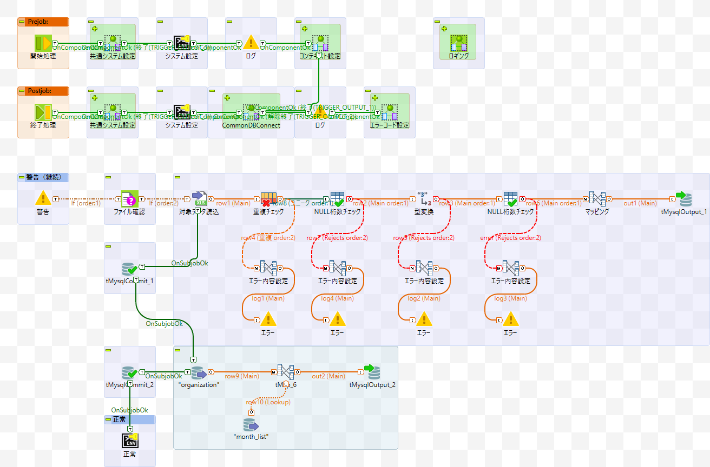

## Project 03
### 예산 측정용 통계자료 개발 프로젝트 (고객:Checker Support)
#### 고객소개
- 회사명 : Checker Support
- 본사 : 일본 도쿄도
- 사업내용 : 레지 아웃소싱 사업, 교육 컨설팅 사업, 파견업 등
- 직원수 : 217명 (파견스탭 약 6,500명)

#### 프로젝트 개요
예산 설정을 위한, 예산과 실적 데이터 통계

Excel로 제출된 각 부서의 항목별 예산 데이터의 데이터베이스화(MySQL)
실적데이터와 예산데이터의 레포트 개발

* 프로젝트기간 : 1개월
* 프로젝트멤버 : 2명(본인이 메인으로 담당, 추가 1명은 3명의 멤버가 돌아가며 작업)

#### 개발내용
1. 제출기간에 맞춰 Excel로 제출된 각 부서의 항목별 예산 데이터를 데이터베이스에 등록하는 ETL개발
2. 매일 등록되는 실적 데이터를 자동 갱신하는 ETL개발
3. 실적데이터와 예산데이터를 이용하여 부서별, 기간별 달성률 통계
4. WEB으로 실시간 확인 가능하도록 가시화 레포트 개발

#### 개발한 레포트 
* 예산확정 회의 제출용 레포트

   수정이 필요할때마다 데이터를 모아 Excel로 수식을 이용하여 제작하던 레포트를 
    BI툴을 이용하여 자동화 시킴으로 업무시간을 단축시킴
  
* 실시간 달성률 확인 레포트

    확정된 예산과 매일 실시간 실적데이터를 이용하여 바로바로 달성률이 확인 가능하도록 BI레포트 개발

#### 개발한 ETL
개발한 job은 bat파일로 출력 후 Windows Task Schedule에 등록하여 자동실행된다.

* 지정 폴더에 제출된 Excel파일을 전부 DB등록
* Oracle에서 MySQL로 데이터이동
* 데이터 클리닝
* 레포팅에 필요한 데이터 구성에 맞춘 데이터 가공

등의 job를 개발하였습니다.

개발된 job 중 레포트용 데이터 가공 부분의 화면이미지.

개발된 job 중 Excel파일의 데이터를 이용한 부분의 화면이미지.

#### 경험한 내용
예산측정을 한달 앞두고 급하게 시작한 프로젝트였으나 2주간의 개발과 테스트 
그리고 2주간의 현지검수를 통해 무사히 예산 측정시기에 맞춰 통계자료를 작성하는데 성공하였습니다.

시간에 쫓기는 프로젝트였어서 대략적인 개발을 마치고 바로 
현장에 가서 담당자분과 바로바로 피드백을 주고받으며 개발을 완료하고 테스트, 검수까지 완료시켜야 했으며
갑작스럽게 시작되었기 때문에 다른 멤버가 3명이 돌아가서면서 진행하였기 때문에
고객 담당자분과의 관계형성과 프로젝트를 진행하는 멤버와의 연계가 매우 중요했습니다.

PM은 아니었지만 고객담당자와의 스케쥴조정, 연락, 멤버들의 작업내용조절 등을 전부 맡아서 진행해야 했기때문에 
PM의 업무의 일부분을 담당할 수 있어 많은 공부가 된 프로젝트였습니다.

------------------------------
