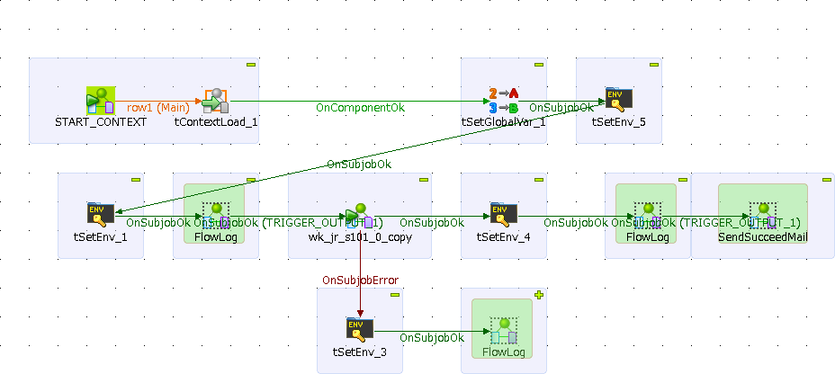
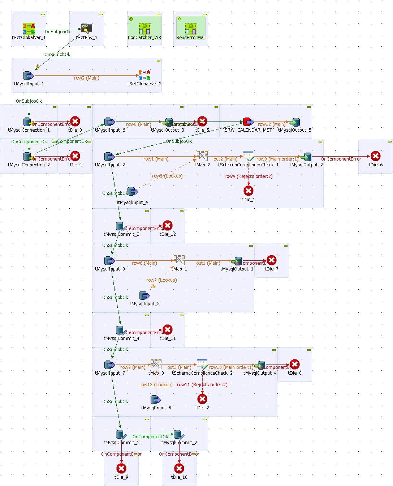

## Project 05
### 데이터 분석 지원 프로젝트 (고객:MEIDENSHA)
#### 고객소개
- 회사명 : MEIDENSHA CORPORATION
- 본사 : 일본 도쿄도
- 사업내용 : 전기에너지시스템, 물처리시스템, 정보통신시스템, 산업시스템 등 개발, 생산,판매
- 직원수 : 9,297

#### 프로젝트 개요
종업원의 근무데이터를 분석해, 근로시간 및 유급휴가 관리 등 법률에 맞는 근로내용 분석,파악

인사시스템의 DB(Oracle)으로부터 데이터를 수집하여 인사데이터베이스를 구축(사용DB : MySQL)

구축된 데이터베이스를 이용해 각종 데이터분석 레포트를 개발

* 프로젝트기간 : 6개월
* 프로젝트멤버 : 2명

#### 개발내용
1. 근무관리 시스템에서 Oracle에 등록되는 데이터를 MySQL에 연계시키는 ETL개발
2. 잔업시간 관리를 위한 부서별 잔업시간 실시간 통계
3. 매달 2회 실시간 잔업시간을 분석해 기준치를 넘은 종업원에게 자동 알람메일을 송신하는 ETL개발

#### 개발한 레포트
일본의 법률개정으로 인해 종업원과 그의 상사가 잔업시간을 실시간으로 파악하여 조절 및 주의를 할 수 있도록
실시간으로 잔업시간을 볼 수 있는 레포트를 개발하였습니다.

또한, 잔업시간이 기준시간을 넘은 사람에게 메일을 보낼 때에 보내지는 메일을 받은 직원 리스트를 
담당 상사가 확인할 수 있는 레포트도 개발하였습니다.

#### 개발한 ETL
개발한 job은 bat파일로 출력 후 Windows Task Schedule에 등록하여 자동실행된다.

* Oracle에서 MySQL로 데이터이동
* 데이터 클리닝
* 레포팅에 필요한 데이터 구성에 맞춘 데이터 가공

등의 job를 개발하였습니다.

개발된 job 중 [알람메일송신]의 화면이미지.

개발된 job 중 데이터가공 단계 중 1개의 화면이미지.

#### 경험한 내용
담당했던 프로젝트 중 가장 오래된 프로젝트였습니다.

담당자분이 IT에 대해 전혀 지식이 없는 분이었기 때문에 알기 쉽게 설명을 하기 위해 많이 노력을 했던 프로젝트 이었고
덕분에 담당자분과도 좋은 관계를 형성할 수 있었습니다.

잔업시간 관련 프로젝트 중 초창기에 진행된 프로젝트 이었기 때문에
많은 시행착오를 겪어가며 진행항 프로젝트 이었습니다.

덕분에 후에 비슷한 프로젝트를 진행할때에 문제가 생겼을때 어느 부분을 확인하고 수정해가야 하는지
어떤 부분을 담당자에게 확인하고 조사해야하는지 많은 노하우를 쌓을 수 있었습니다.

------------------------------
