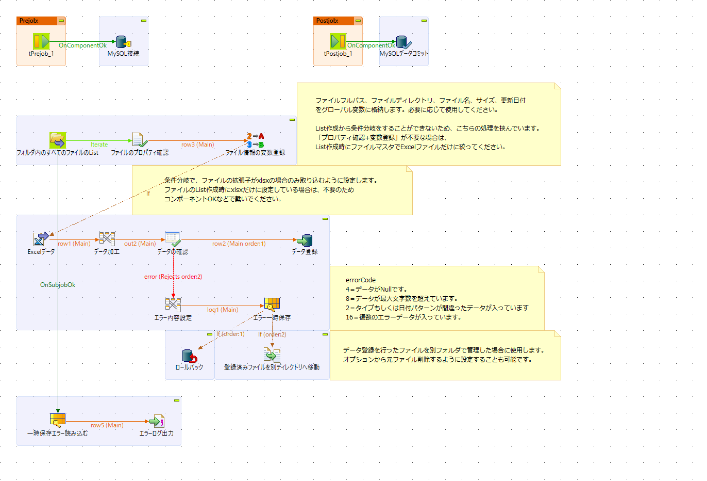
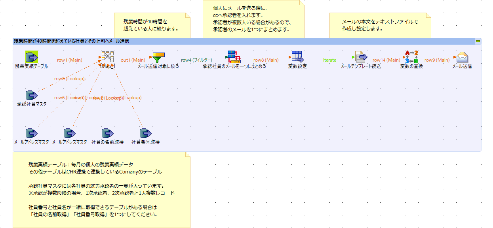
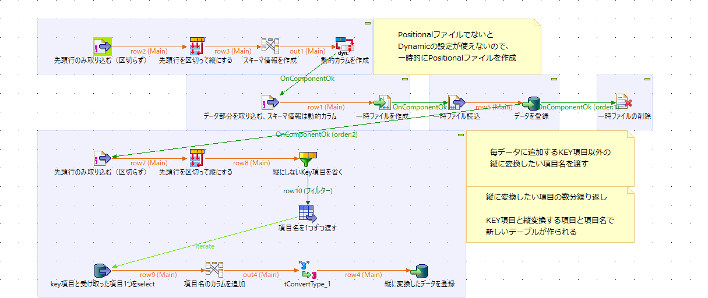
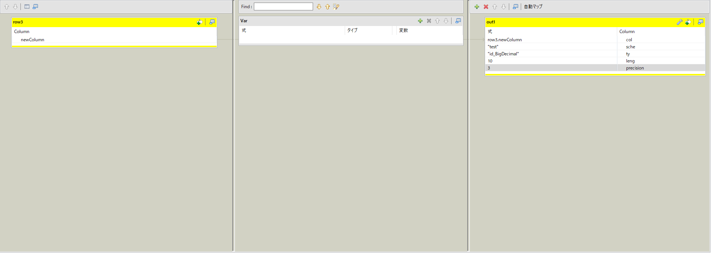
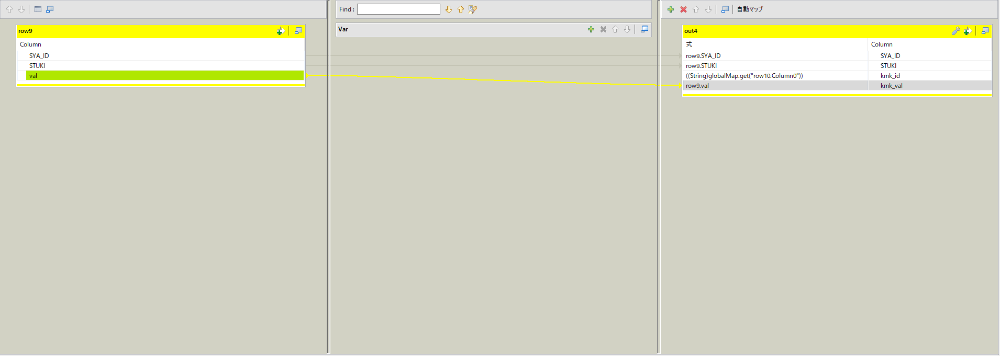

## 샘플 job 설명서
### 1. 파일 데이터 등록
#### 설명
지정한 폴더 안에 있는 Excel파일을 전부 읽어들여 데이터베이스에 등록하는 처리를 진행한다.
이 때에 Excel파일은 전부 같은 구성의 데이터이어야만 한다.(같은 테이블에 등록되기 때문)

정상적으로 데이터가 데이터베이스에 등록되면 읽어들인 파일은 별도의 폴더에 이동되며,
실패시 롤백(원상태로 돌려놓기)한다.

샘플job를 응용해서 사용할 시 불필요한 컨포넌트는 삭제해서 사용할 수 있다.

#### 처리 내용

※ 위에서 부터 차례대로 일본어로 적어둔 메모를 한국어로 번역한 내용입니다.

1. 파일의 풀패스, 파일의 디렉토리, 파일명, 사이즈, 수정날짜를 글로벌변수에 등록합니다.

	필요에 따라서 사용해주세요.

	폴더에서 파일의 리스트를 불러들인 즉시 조건분기를 할 수 없기 때문에, 
	불러들인 리스트에서 파일을 하나씩 읽어들이며 설정정보를 변수에 등록하고 있습니다.

	설정정보를 변수에 등록하고 싶지 않은 경우에는 폴더에서 파일의 리스트를 불러들일 때에 파일마스터를 사용해 필요한 파일을 
	지정해주세요(요번 샘플의 경우 Excel파일만 읽어들이도록 설정해야함).
	
2. 조건분기에서 파일의 확장자가 xlsx인 경우만 파일을 읽어들이도록 설정합니다.

	파일의 리스트 작성시에 파일마스터를 사용해 xlsx만 읽어들이도록 설정한 경우에는 이 처리가 불필요함으로

	조건분기의 선 대신 [컨포넌트OK]등의 선으로 처리를 이어줍니다.
	
3. 에러코드

	2 : 데이터타입 혹은 날짜데이터의 패턴을 틀린 데이터가 들어있습니다.
	
	4 : 데이터가 Null입니다.

	8 : 데이터가 최대문자수를 넘었습니다.

	16 : 복수의 에러를 갖은 데이터가 들어있습니다.
	
4. 데이터를 등록한 파일을 별도의 폴더에서 관리하고자 할 경우에 사용합니다.

	옵션에서 기존파일을 삭제하도록 설정할 수 도 있습니다.
(설정하지 않을경우 기존폴더와 새로운폴더 양쪽에 같은 파일이 존재합니다.)

#### 자세한 Job의 내용은 
 [html도큐먼트](/Sample_job_document/Excel_Import/Excel_Import_0.1.html)에서 확인이 가능합니다.

단지 언어는 일본어로 작성되어 있습니다.

※도큐먼트 확인 시, 폴더 전체를 다운받아 html을 실행시켜 확인해주세요

### 2. 메일 송신
#### 설명
정기화된 데이터베이스에서 필요한 데이터를 입력받은 뒤 메일송신대상에게 일괄적으로 메일을 송신한다.

이 때에 송신용 메일의 본문은 텍스트파일로 템플릿을 만들어두면 좋다.

탬플릿에 입력해둔 변수를 이용해 동적으로 본문을 설정할 수 있다.

예를들어 템플렛에 "#name 님"라고 적은경우, #name에 데이터베이스에서 습득한 이름데이터를 자동으로 넣을 수 있다.

샘플job를 응용해서 사용할 시 불필요한 컨포넌트는 삭제해서 사용할 수 있다.

#### 처리 내용

※ 일본어로 적어둔 윗줄의 메모를 왼쪽부터 차례대로 한국어로 번역한 내용입니다.
	밑에줄에 있는 메모는 입력받는 데이터에 대한 메모이므로 생략합니다.

요번 샘플에서는 잔업실적row데이터, 승인사원마스터, 메일주소마스터, 사원마스터 등의 데이터를 이용해 메일을 송신하는 시점의 달(month)의 잔업시간이 40시간을 넘은 사람을 대상으로 메일을 보내도록 하고있습니다.

1. 필터 컴포턴트를 이용해 잔업시간이 40시간을 넘은 사람의 데이터를 추려냅니다.

2. 당사자에게 메일을 보낼 때에 CC에 승인사원(상사)의 메일주소를 넣도록 합니다.

	당사자 한명당 승인사원이 복수 있는 경우가 있을 수 있기 때문에, 승인사원 메일을 1줄로 이어줍니다.
	(aaa@mail.com, bbb@mail.com ... 와 같이 이어줍니다)

3. 메일 본문을 텍스트파일로 작성해 읽어들입니다.
	이 때 만들어둔 텍스트 파일은 한 줄의 데이터로써 읽어집니다.
한 줄로 읽어진 데이터에 변수가 포함되어 있는경우 치환(tReplace)컴포넌트를 이용해 변수와 데이터를 연결시켜줍니다.

### 3. 동적컬럼을 사용한 가로세로변환
#### 설명
입력받는 csv파일의 항목이 가변적인 경우, 동적컬럼을 사용하여 파일을 읽어들일 때에 자동으로 스키마의 정보를 설정하면서 읽어들인다.

예를들어, key가 될 컬럼과 비슷한형태의 가변적인 컬럼이 입력되어 들어오는 경우에 사용할 수 있다.

[ID, 년, 월, A팀실적, B팀실적, E팀실적 ...] 와 같이
매번 [ID, 년, 월]의 컬럼은 고정으로 들어오나 실적 컬럼이 입력되는 팀이 달라지는 경우. 

#### 처리 내용

※ 일본어로 적어둔 메모를 윗쪽부터 차례대로 한국어로 번역한 내용에 추가 설명을 포함한 내용입니다.

1. 파일의 첫줄(컬럼명이 들어있는 데이터)의 데이터만 한개의 데이터로 이어서 읽어들인 후, ","로 잘라서 세로로 나열되도록 데이터를 변형시킨다.

	변형시킨 컬럼명으로 쓰일 데이터가 들어있는 컬럼을 사용해 동적컬럼을 작성한다.
	
	
	
	컬럼명(전 컬럼), 스키마명, 데이터타입, 데이터길이, 소숫점단위 등을 설정할 수 있다.

	※샘플에서는 모든 컬럼을 BigDecimal로 설정하고 있으나, tMap에서 컬럼별로 다르게 설정되도록 규칙을 작성할 수 있다.

2. CSV파일에서 데이터 부분을 읽어들인다(스키마 정보는 Dynamic형)

	Positional파일이 아니면 Dynamic의 설정을 사용할 수 없으므로 읽어들인 데이터를 일시적으로 Positional파일로 출력한다.
	
3. Positional파일을 읽어들여(DynamicSchema를 사용하도록 설정한다. 자동으로 1에서 작성한 설정이 적용된다.) 데이터베이스에 등록한다.

	일시적으로 사용하기 위해 작성한 Positional파일은 불필요하게 되었으므로 삭제한다.
	
--- 여기까지가 동적 컬럼(Dynamic Schema)를 사용하여 데이터를 등록하는 방법 ---

4. 다시한번 파일의 첫줄(컬럼명이 들어있는 데이터)의 데이터만 한개의 데이터로 이어서 읽어들인 후, ","로 잘라서 세로로 나열되도록 데이터를 변형시킨다.

	세로로 변형시키고 싶지 않은 항목(key컬럼)을 제거한 후, 남은 컬럼명을 1개씩 변수에 등록해 넘겨준다.
	
	예를들어  [ID, 년, 월]을 제거하고 [A팀실적, B팀실적, E팀실적 ...]만 남긴 후 1개씩 넘겨준다.

5. 3에서 등록한 데이터베이스 테이블에서 key컬럼과 4에서 넘겨받은 컬럼을 select하는 SQL을 실행한다.

	※key항목은 고정, 넘겨받은 컬럼1개는 가변으로 변해가며 데이터를 습득한다. 
	
	[ID, 년, 월]는 고정, [A팀실적, B팀실적, E팀실적 ...]은 1개씩 가변적으로 입력되어 SQL이 실행된다.

6. 컬럼을 설정한다.

	
	
	key항목은 그대로 넘겨받고, 가로에서 세로로 변경하고자 하는 항목은 항목Id와 항목치의 데이터를 만들어 입력시킨다.
	
	[ID, 년, 월, 팀, 실적]의 항목을 만들어서
	
	[ID, 년, 월, "A",  A팀실적]의 형태로 매핑한다.

7. 각 항목의 데이터형태가 다를 수 있기 때문에 convertType을 이용해 데이터형태를 변경시킨다.

	※불필요시 생략 가능
	
8. 변경된 데이터를 데이터베이스에 등록한다.

##### 변경 전/후 데이터 이미지

[ID, 년, 월, A팀실적, B팀실적, E팀실적 ...]

1,2020,06,111111,222222,333333, ...

▼

[ID, 년, 월, 팀, 실적]

1,2020,06,"A",111111

1,2020,06,"B",222222

1,2020,06,"C",333333

.

.

.

----------
End. 샘플job설명서 
